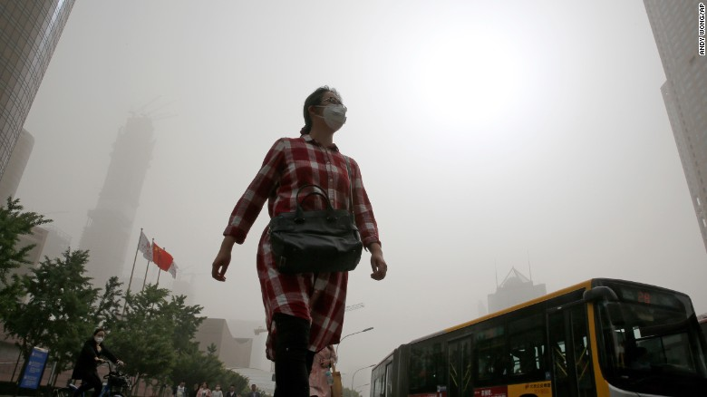

# Under the Dome -- Beijing PM2.5 Air Pollution Analysis Using Time Series Analysis and Linear Regression



## Columbia University 
**Spring 2019 GR5223 Group project**

## Team members:

Xinyi Hu: xh2383

Xinge Jia: xj2221

Nikita Tourani:nrt2117


## Main topic:

China has faced a severe and unsolved air pollution problem for years, with PM2.5 being the main pollutant.

Two members of our team are from China and both of them have suffered from very unhealthy level of PM2.5. Thus, we want to know more about PM2.5 in a statistical way and attempt to find remedy for this issue.

## Data:

The data set that we used is downloaded from https://archive.ics.uci.edu/ml/datasets/Beijing+PM2.5+Data. In this data set, hourly PM2.5 data of US Embassy in Beijing has been collected. The data set also includes meteorological data such as dew point, temperature, cumulated hours of rain etc.

## Project summary:

In this project, we used R to perform the analysis. 

We examined the data and quantified the severity of the problem with a statistical approach.

In the first section, we analyzed some descriptive statistics.

Followed by the time series analysis section, the project focused on how PM2.5 values vary under different frequencies. And then by fitting suitable models and doing model diagnostics, we tried to find the pattern of PM2.5.

Finally, we performed linear regression analysis to select the model consisting of variables that influence PM2.5 in Beijing significantly, which helped us to identify the relevant factors and take actions to prevent the high levels of PM2.5 in the future.

**This folder is orgarnized as follows.**

```
proj/
├── Completed version/
├── code/
├── data/
├── document/
└── reference/
```

Please see each subfolder for a README file.
